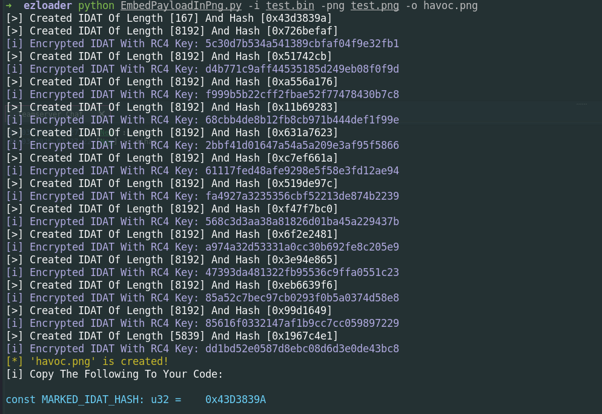
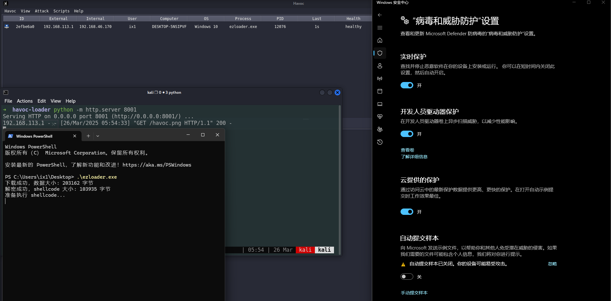

# ezloader

一个ez的shellcode loader，会慢慢改进

## Features

- 在 PNG 文件中嵌入shellcode并且使用RC4加密
- HTTP/S PNG 暂存
- 使用 EnumSystemLocalesEx 回调函数执行shellcode

## Usage

1. 使用EmbedPayloadInPng.py生成带有shellcode的png

   

2. 复制`EmbedPayloadInPng.py`输出的MARKED_IDAT_HASH常量定义替换`src/main.rc`里现有的定义。
3. 将生成带有shellcode的png图片，放置web服务器上。
4. 编译运行，也可以直接运行`一键生成.bat`，会在metatwin下生成带有图标等其他资源的exe。

## Testing with Havoc and the Latest Windows Defender

## References and acknowledgments

https://github.com/threatexpress/metatwin

https://github.com/johnthagen/min-sized-rust

https://github.com/joaoviictorti/RustRedOps

https://github.com/Maldev-Academy/EmbedPayloadInPng