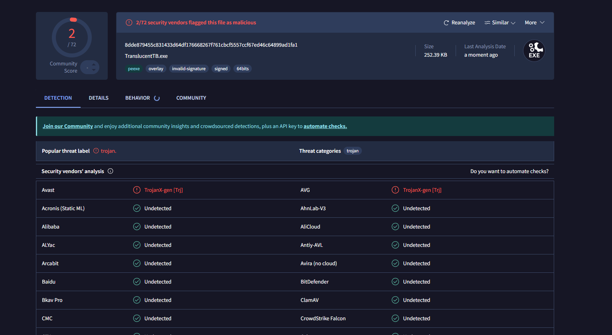
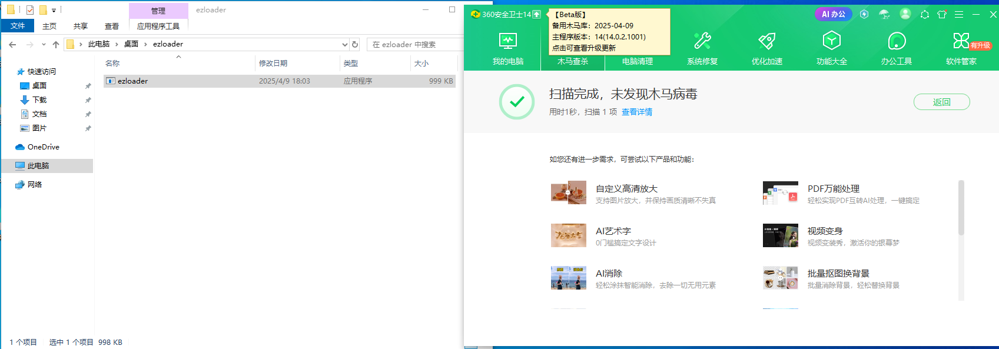
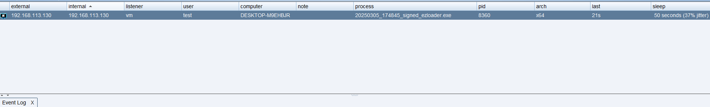

没啥技术含量的免杀🐎生成，流程如下。

1. sgn处理shellcode，实现自解密
2. 套用[github.com/joaoviictorti/RustRedOps/tree/main/Local_Payload_Exec...](https://github.com/joaoviictorti/RustRedOps/tree/main/Local_Payload_Execution)的代码
3. https://github.com/johnthagen/min-sized-rust减少生成大小
4. 使用https://github.com/threatexpress/metatwin将白文件的文件资源克隆到我们生成的🐎

# 目录结构

------

```undefined
├─metatwin					# https://github.com/threatexpress/metatwin 项目文件
├─sgn_windows_amd64_2.0.1	# sgn 可执行文件
├─src						# 源码
└─target					# 生成的exe
```

# 使用方法

------

将你生成的恶意shellcode放到src目录下，命名为beacon_x64.bin，然后运行一键生成.bat。

最终生成的exe在metatwin目录下以时间戳命名的目录下

# 测试

------

2025/3/5







# 参考

------

https://github.com/threatexpress/metatwin

https://github.com/johnthagen/min-sized-rust

https://github.com/joaoviictorti/RustRedOps/tree/main/Local_Payload_Execution

https://github.com/EgeBalci/sgn