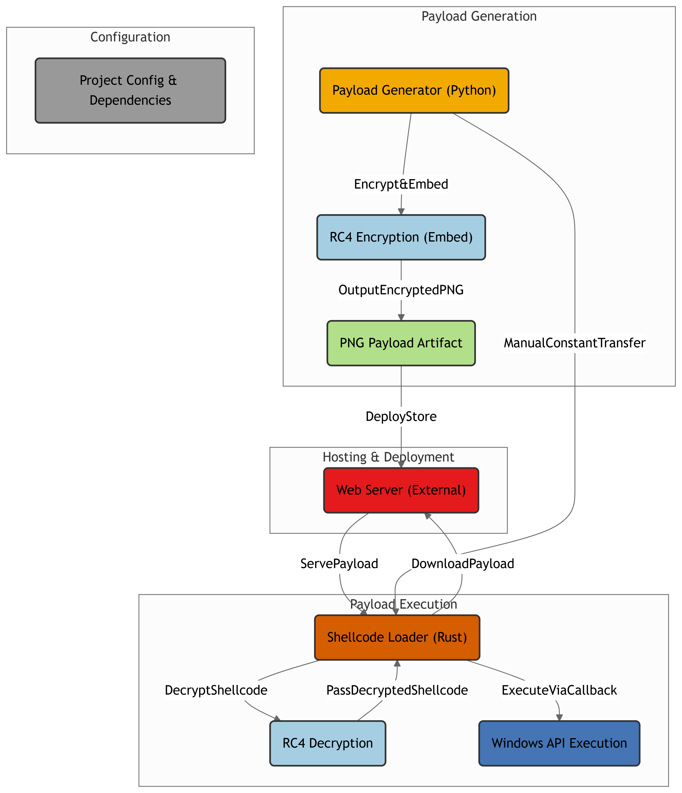
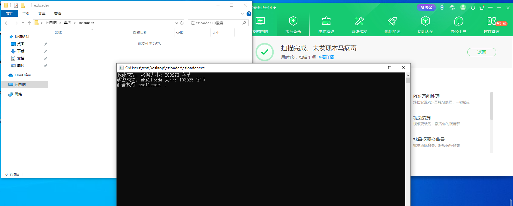
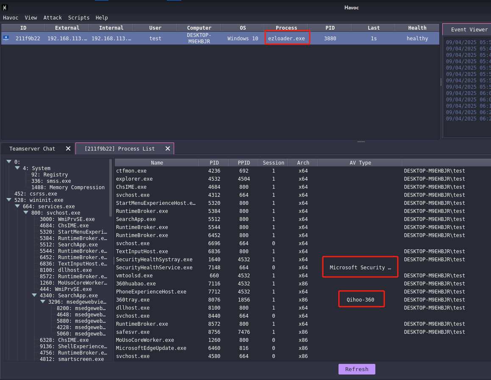

# ezloader

一个ez的shellcode loader，会慢慢改进

## Features

- 在 PNG 文件中嵌入shellcode并且使用RC4加密
- HTTP/S PNG 暂存
- 使用 EnumSystemLocalesEx 回调函数执行shellcode
- 简单的反沙箱检测
- 自删除

## Usage

1. 使用EmbedPayloadInPng.py生成带有shellcode的png

   

2. 复制`EmbedPayloadInPng.py`输出的MARKED_IDAT_HASH常量定义替换`src/main.rc`里现有的定义，把111行替换为你自己的地址。
3. 将生成带有shellcode的png图片，放置web服务器上。
4. `cargo build -r` 编译。

## Testing with Havoc and the Latest Windows Defender


## Testing with Havoc and the Latest 360安全卫士

```360木马查杀扫描日志
360木马查杀扫描日志
开始时间: 2025-4-9 18:28:45
扫描用时: 00:00:01
扫描类型: 自定义扫描
扫描引擎:360云查杀引擎（本地木马库）  360启发式引擎  QEX脚本查杀引擎 
扫描文件数: 1
系统关键位置文件: 0
系统内存运行模块: 0
压缩包文件: 0
安全的文件数: 1
发现安全威胁: 0
已处理安全威胁: 0


扫描选项
扫描后自动关机: 否
扫描模式: 快速模式
管理员：是


扫描内容
C:\Users\test\Desktop\ezloader\ezloader.exe


白名单设置


扫描结果
未发现安全威胁


```


执行后自删除



上线成功



## References and acknowledgments

https://github.com/johnthagen/min-sized-rust

https://github.com/joaoviictorti/RustRedOps

https://github.com/Maldev-Academy/EmbedPayloadInPng